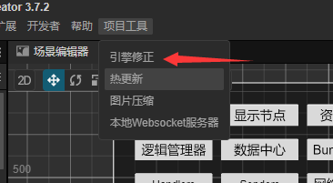
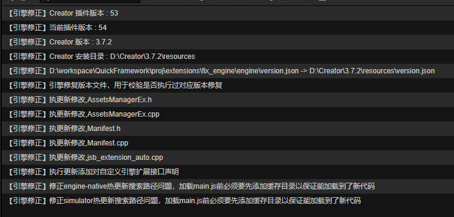
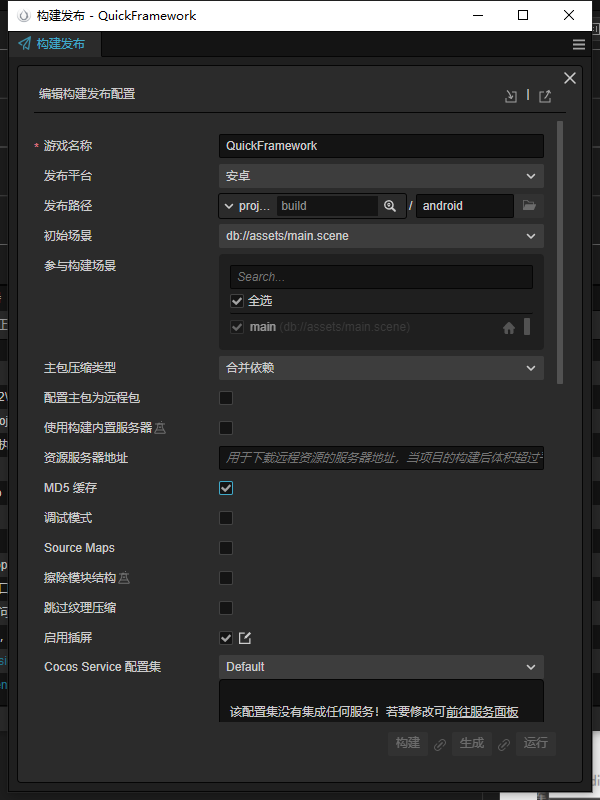
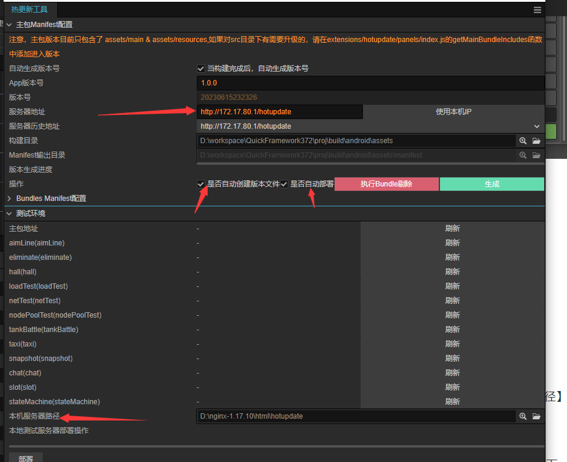
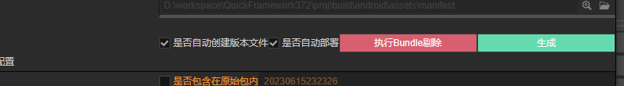

# 1，修正引擎
【项目工具】-> 【引擎修正】
如下图:

# 2，构建!
## 按官方来就行，按自己需求选择

## 建议构建时打个热更新插件界面

### 服务器地址
填写好自己的资源服务器地址,即热更新的CDN地址
### 建议开启【是否自动创建版本文件】
构建完成后，会自己的生成相关的版本文件
### 建议开启【是否自动部署】
【本地server物理路径】可随意指定一个目前，或者自己本地服务器的目录
当生成版本文件完成后，插件会把需要更新的文件部署到【本地server物理路径】下
### 上传更新资源
把【本地server物理路径】生成出来的所有文件，复制到你的热更新CDN目录下

# 3，剔除不需要在主包内的bundle

控制台会有相应日志

# 4，后台就是常规的安卓打包